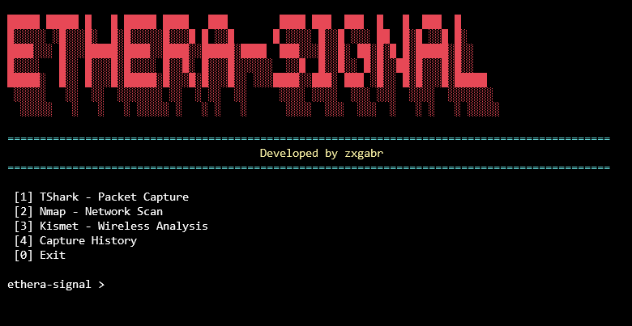

# Ethera-Signal

Ferramenta desenvolvida em **Python** para automação e centralização de atividades de análise e testes de segurança em redes.

O **Ethera-Signal** integra diferentes ferramentas de análise de redes em uma única interface, permitindo executar seus recursos a partir de um menu centralizado.

## Interface



A interface principal disponibiliza as seguintes funcionalidades:

* **TShark** — captura e análise de tráfego de rede.
* **Nmap** — identificação de hosts, portas e serviços de rede.
* **Kismet** — monitoramento e análise de redes sem fio.
* **Capture History** — registro das execuções realizadas pela aplicação.

## Tecnologias

* Python
* TShark
* Nmap
* Kismet
* WSL2 / Kali Linux
* Npcap
* JSON

## Requisitos

* Python 3.10 ou superior
* Windows 10/11 ou Linux
* TShark instalado e disponível no `PATH`
* Nmap instalado e disponível no `PATH`
* Kismet instalado para utilização do módulo de análise wireless
* Npcap no Windows para captura de tráfego pelo TShark
* WSL2 + Kali Linux para execução do Kismet no ambiente utilizado no projeto
* Adaptador Wi-Fi compatível com modo monitor para captura wireless com o Kismet
* Permissões adequadas para captura de tráfego e execução das ferramentas

## Funcionamento

O Ethera-Signal atua como uma camada de integração entre o usuário e as ferramentas externas. A aplicação recebe os parâmetros informados pelo operador e utiliza o módulo `subprocess` do Python para executar os respectivos processos.

As execuções podem ser realizadas em diferentes ambientes, de acordo com os requisitos de cada ferramenta. O projeto foi desenvolvido e testado em **Windows 11** e **Kali Linux utilizando WSL2**.

## Estrutura

```text
Ethera-Signal/
├── README.md
├── .gitignore
├── src/
│   ├── modules/
│   │   ├── actions.py
│   │   ├── history.py
│   │   ├── kismet.py
│   │   ├── nmap.py
│   │   └── tshark.py
│   ├── ui/
│   │   ├── art.py
│   │   ├── colors.py
│   │   └── menu.py
│   ├── utils/
│   │   └── helpers.py
│   └── main.py
├── captures/
├── venv/
└── venv-linux/
```

## Objetivo

O projeto foi desenvolvido como parte de uma pesquisa acadêmica sobre **segurança de redes corporativas sem fio**, buscando facilitar a execução e a organização de ferramentas utilizadas em atividades de análise de redes e testes de segurança.

## Observação

O Ethera-Signal é destinado a **ambientes controlados e autorizados**. As ferramentas integradas devem ser utilizadas somente em redes, dispositivos e sistemas sobre os quais o operador possua autorização para realizar análises.
